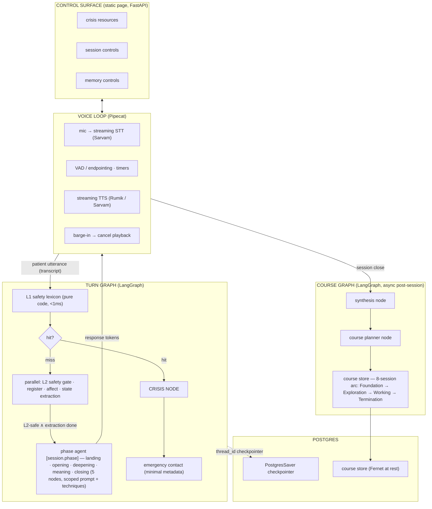

# ai-therapist

Voice-first, model-agnostic AI therapy companion — research prototype.
Authoritative specs: `docs/methodology.md` (why), `docs/implementation.md` (how),
`docs/research.md` (grounding). Design doc: `docs/features.json`.

## Quick start

```bash
make setup    # uv sync backend deps + Postgres container up
make dev      # FastAPI dev server (control surface + /ws voice endpoint)
make test     # pytest
make style    # ruff format + check
```

## Environment / API keys

Copy `.env.example` to `.env` and fill in the values. **Never commit `.env`.**

| Key | Where to get it |
|---|---|
| `MAIN_MODEL`, `EXTRACTION_MODEL`, `SAFETY_MODEL` | LiteLLM model strings — https://docs.litellm.ai/docs/providers |
| `GEMINI_API_KEY` | https://aistudio.google.com/app/apikey |
| `GROQ_API_KEY` | https://console.groq.com/keys |
| `SARVAM_API_KEY` | https://dashboard.sarvam.ai (Saaras STT, Bulbul TTS) |
| `RUMIK_API_KEY` | https://rumik.ai (Silk — Mulberry/Muga TTS) — optional, no free tier |
| `SECRET_KEY` | `python -c "from cryptography.fernet import Fernet; print(Fernet.generate_key().decode())"` |
| `DATABASE_URL` | Provided — matches the Postgres container from `make setup` |

## Architecture

